# Bruixes i Fades Frontend Project 

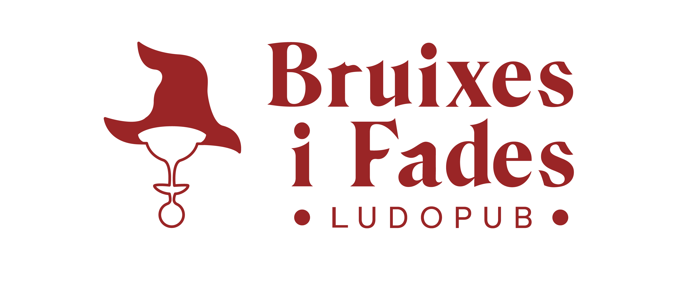

This repository contains the frontend code for the mobile web application Bruixes i Fades.

Backend of this project: [Bruixes i Fades Backend](https://github.com/marinaescriva/Bruixes_Backend)

## About the project

Bruixes i Fades is a board game pub where you can enjoy different beers and play board games with friends.

## Project Development and Ideation

The project idea stems from a local café near my home, for which I created a comprehensive graphic identity project in 2022: [Bruixes i Fades](https://marinaescrivasalvador.myportfolio.com/bruixes-fades)

## Stack

[](https://reactjs.org/)[](https://www.javascript.com/)[](https://git-scm.com/)

## Installation

Here's how to install the repository

1. Clone the repository

```bash
git clone https://github.com/marinaescriva/Bruixes_Frontend.git
```

2. Install dependencies

```bash
npm install
```

3. Start the development server

```bash
npm start
```

## Features

- ##### User Registration: 
Allows users to register.
- ##### User Login: 
Allows users to log in.
- ##### View Games: 
Displays all available games.
- ##### Delete Game: 
Deletes a game by its ID.
- ##### View Tables: 
Displays all available tables.
- ##### Delete Table: 
Deletes a table by its ID.
- ##### View Users: 
Displays all users (Super Admin only).
- ##### View Profile: 
Displays the profile of the current user.
- ##### Update Profile: 
Allows the current user to update their profile.
- ##### Delete User: 
Deletes a user by its ID (Super Admin only).
- ##### View Reservations: 
Displays all reservations (Super Admin only).
- ##### New Reservation: 
Allows users to make a new reservation.
- ##### View My Reservations: 
Displays reservations of the current user.
- ##### Delete Reservation: 
Deletes a reservation by its ID (Super Admin or owner only).

## Screenshots

<details> 
<summary> Home </summary>

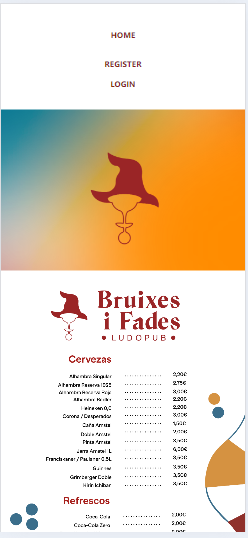

</details>

<details> 
<summary> Register </summary>

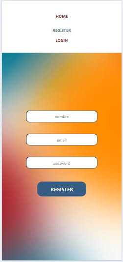
</details>

<details>
<summary> Login </summary>

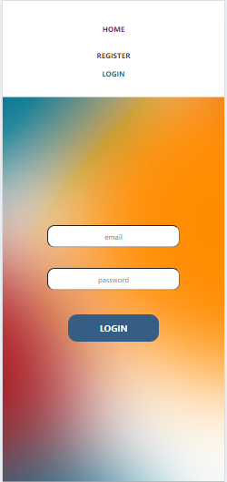
</details>

<details>
<summary> User profile</summary>

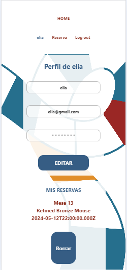
</details>

<details>
<summary> Reservation </summary>

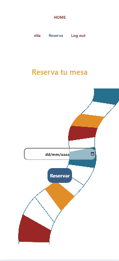
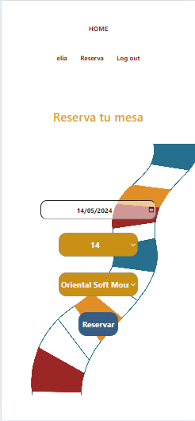
</details>

<details>
<summary> Admin pannel </summary>

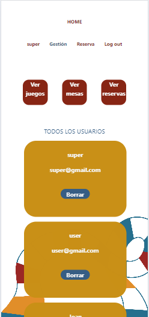
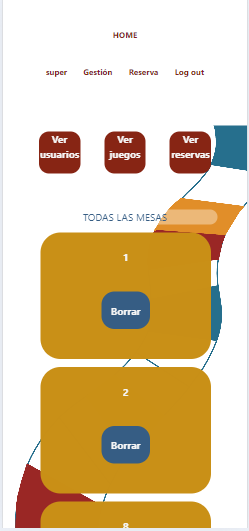
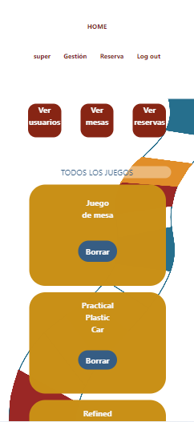
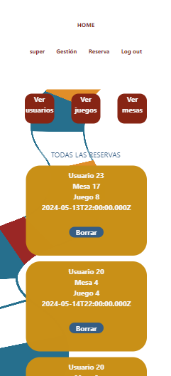

</details>

### Video 

[Bruixes i Fades APP on Youtube](https://youtu.be/RH36f2kh5FM)


### Future features

- Add events to join
- Limit reservations choose diferent params like date/table/game to allow more options
- Add more information about games ( players , duration..etc)

### Author

- Marina Escrivà 

[LinkedIn](https://www.linkedin.com/in/marina-escriv%C3%A1-salvador-047134100/) 

[Porfolio](https://marinaescrivasalvador.myportfolio.com/) 

[marinaescriva.24@gmail.com](mailto:marinaescriva.24@gmail.com) 

